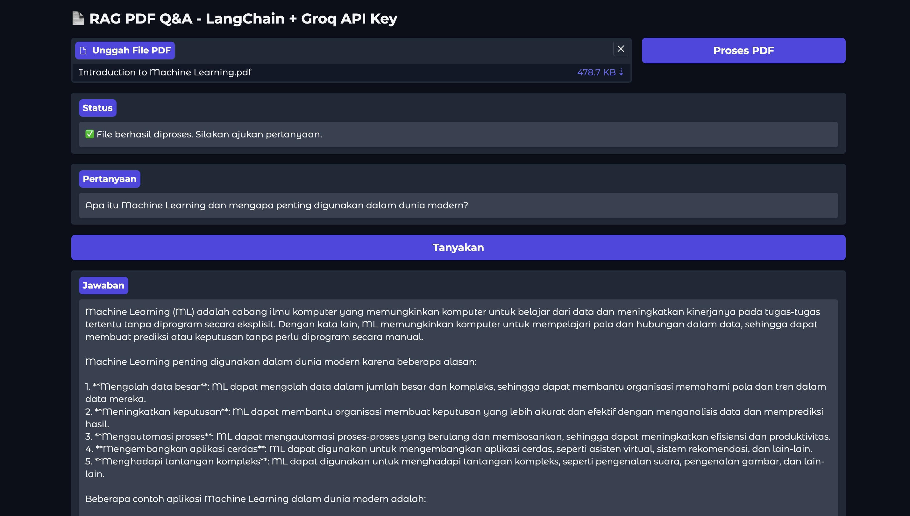
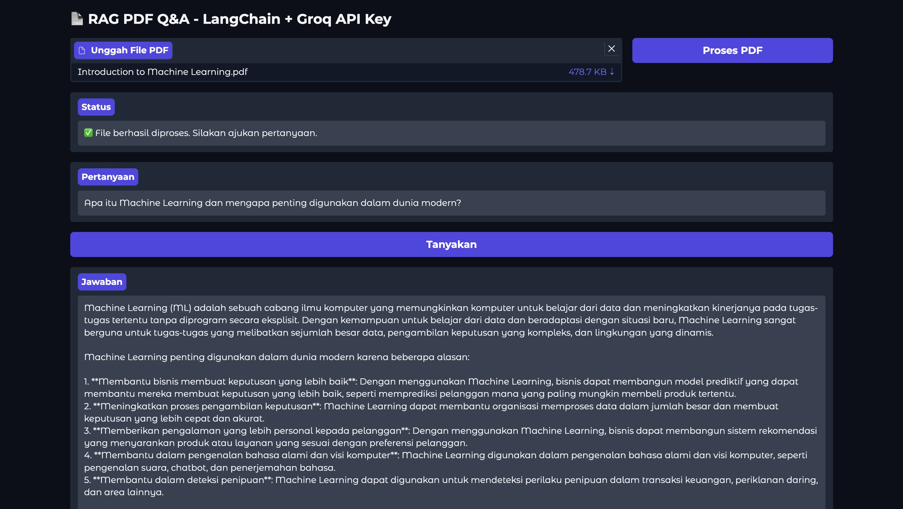
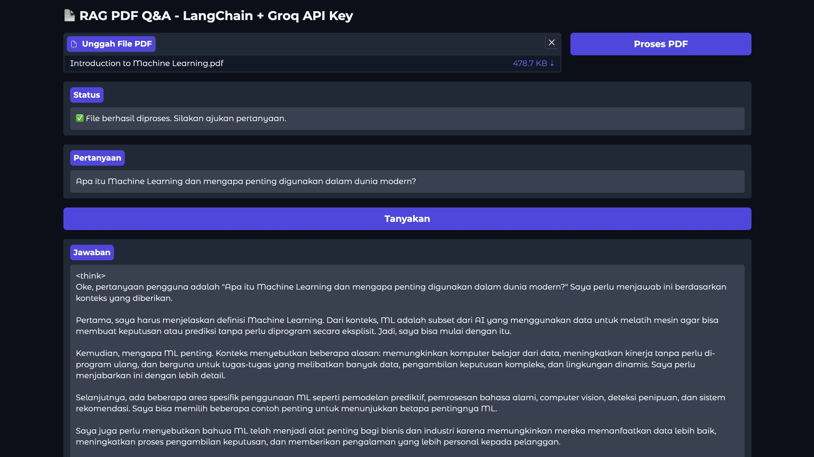
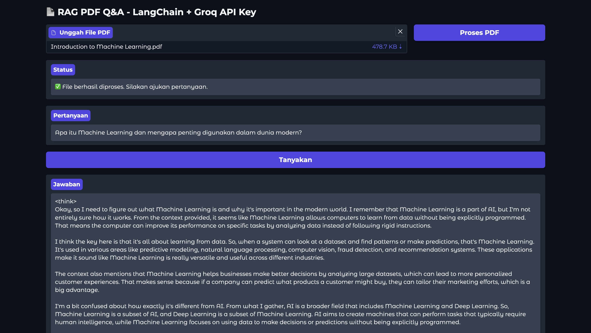
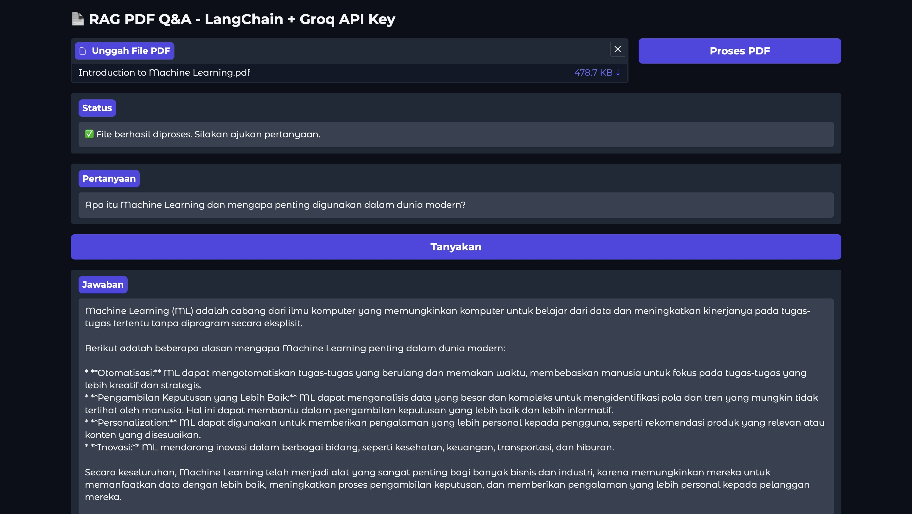
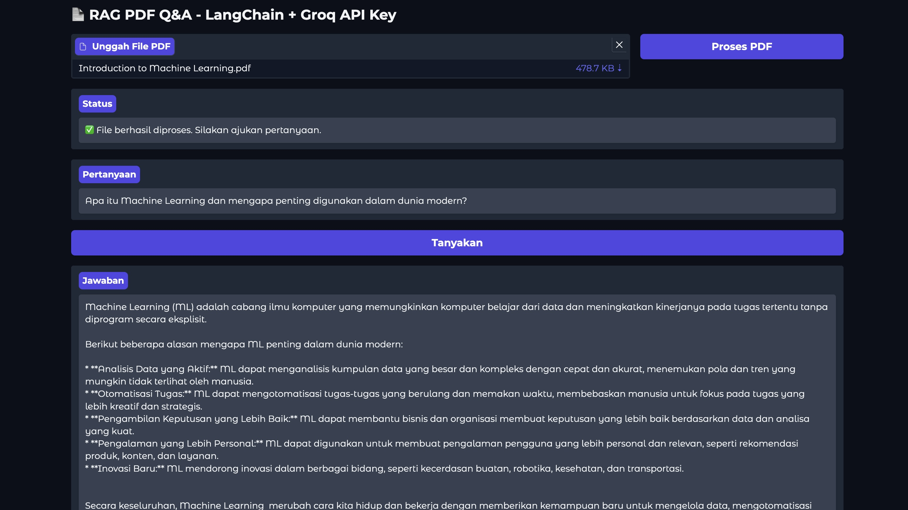

<h1 align="center"> Retrieval-Augmented Generation with Gradio and Groq API Key</h1>
<p align="center"> Natural Language Processing Project</p>

<div align="center">


</div>

### Name : Devin Faiz Faturahman
### Tech Stack : Python, Gradio, LangChain, HuggingFace Embedding, FAISS vector store

---

### 1. Analysis about how the project works
This project implements Retrieval-Augmented Generation (RAG) using:
- LangChain for building chains combining LLM and retrievers.
- FAISS as the vector similarity search index.
- HuggingFace Embeddings for encoding text into vectors.
- Gradio as a simple user interface.
- Groq API to access large language models like LLaMA and DeepSeek.

Workflow:
1. User uploads a PDF document.
2. The PDF is split into chunks and vectorized.
3. Vectors are stored and indexed using FAISS.
4. User asks a question → top similar chunks are retrieved → sent to LLM → answer is returned.

## Analysis Methodology
To evaluate and compare the different models, each was presented with the same prompt. The prompt used for this analysis was: "Apa itu Machine Learning dan mengapa penting digunakan dalam dunia modern?".

The evidence of each model's response, corresponding to the specified model and temperature setting, is documented below with references to image captures:

1. llama-3.3-70b-versatile (Temperature: 0.2) 

2. llama-3.3-70b-versatile (Temperature: 0.8)

3. deepseek-r1-distill-llama-70b (Temperature: 0.2)

4. deepseek-r1-distill-llama-70b (Temperature: 0.8)

5. gemma2-9b-it (Temperature: 0.2)

6. gemma2-9b-it (Temperature: 0.8)


### 2. Analysis about how different every model works on Retrieval-Augmented Generation

```python
def get_llm():
    return ChatGroq(
        groq_api_key=GROQ_API_KEY,
        model_name="llama-3.3-70b-versatile", # Change the model in the code
        temperature=0.2
    )
```
- Model used : ```[llama-3.3-70b-versatile, deepseek-r1-distill-llama-70b, gemma2-9b-it]```

2.1 Analysis on ```llama-3.3-70b-versatile``` : 

This model generally appears to produce comprehensive and well-structured responses. In answering the question, it provided a thorough definition and detailed explanations of ML's importance, with one version even including specific application examples. This suggests a tendency for the model to be quite thorough and aim for completeness in its explanations, making it seem reliable for users seeking detailed information.

2.2 Analysis on ```deepseek-r1-distill-llama-70b``` : 

The output from this model, particularly with its "think" process visible, suggests it has an analytical and methodical approach. The 0.8 temperature version, for instance, not only defined ML but also differentiated it from related concepts and outlined the typical ML process. This indicates that the model is capable of breaking down topics and providing structured, somewhat explanatory outputs, especially when set to encourage more detail.


2.3 Analysis on ```gemma2-9b-it``` : 

Based on its answers, this model seems to prioritize conciseness and directness. Its explanations of Machine Learning were brief, presenting the definition and importance in a very straightforward, often bullet-pointed manner. This suggests that its general characteristic is to be efficient and to-the-point, likely suitable for situations where brevity is preferred over extensive detail.

### 3. Analysis about how temperature works

```python
def get_llm():
    return ChatGroq(
        groq_api_key=GROQ_API_KEY,
        model_name="llama-3.3-70b-versatile",
        temperature=0.2 # Change the temperature value here and analzye
    )
```

3.1 Analysis on higher temperature (0.8)

A higher temperature generally resulted in the models producing more elaborate and descriptive responses. For example, the deepseek-r1-distill-llama-70b model at 0.8 provided a significantly more detailed explanation than its 0.2 counterpart. This suggests that a higher temperature encourages the models to expand on their answers, potentially offering more contextual information or varied phrasing, leading to a more verbose output.

3.2 Analysis on lower temperature (0.2)

Conversely, a lower temperature typically led to outputs that were more focused, factual, and direct. The models, like gemma2-9b-it at 0.2, tended to provide concise information without much elaboration. This indicates that a lower temperature setting generally makes the models adhere more strictly to core information and produce less varied, more precise responses.

### 4. How to run the project

- Clone this repository with : 

```git
git clone https://github.com/DevinFaiz/RAG_with_GroqAPI.git
```

- Copy the ```.env.example``` file and rename it to ```.env```. Edit ```.env``` and add your Groq API key:
```
GROQ_API_KEY=your-groq-api-key
```

- Fill the ```GROQ_API_KEY``` with your Groq API Key, find it here : https://console.groq.com/keys

- Create Virtual Environment
```bash
python -m venv venv
source venv/bin/activate   # macOS/Linux
venv\Scripts\activate      # Windows
```

- Install Dependencies
```bash
pip install -r requirements.txt
```

- Run the App. Gradio will launch the app on a local server.
```bash
python app.py
```

- Modify model and temperature. In `app.py`, change the model or temperature like this:
```python
model_name="deepseek-r1-distill-llama-70b",
temperature=0.8
```

- Try different values and observe the response quality.

- Push to GitHub
```bash
git remote set-url origin https://github.com/<YourRepo>/RAG_with_GroqAPI.git
git add .
git commit -m "RAG with Groq"
git push origin main
```